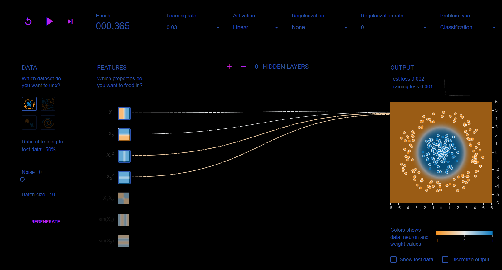
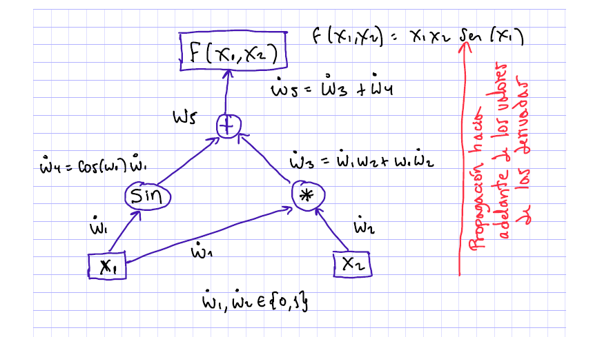

# 2910Lecture

## Memoria persistente; recordar las cosas importantes. (más info->más importancia) ; perceptron basis

-interpretabilidad en modelos:
\*capacidad física y discerscion de la realidad

## diferir datos e info (puedo tener muchos datos pero nada de info) ;

- mucha probabilidad, poca info
- mucha info, poca probabilidad ; viene de : - info : I(X=x) =log_2 (1/p(x)) ; p(x) es la medida de probabilidad -> INCERTIDUMBRE.
  La probabilidad presenta tipos paramétricos y no paramétricos  
   ; medida de velocidad : bytes/sec

# GPT models (and neural architecture):

modelos generadores:
-reciben datos crudos
derivada de una funcion escalon/sigma (cero e infinito en la discontinuidad); no hay aproximaciones puras; es por esto que la famosa es la
sigmoide

learning rate: taza de aprendizaje del modelo, al momento de sintonizar modelos.
-train y test ; to avoid overfitting

intentaremos simular este modelo perceptron:

en esta herramienta:

neural playground tensor flow

; los parámetros a optimizar ahora es la arquitectura, definir cuantas capas y cuantas neuronas, activacion, learning rate, rgularizaiton and classifation type

# Tipos de tarea:

    Clustering , PCA, CLASIFICACION, Regresión... etc;

    - para optimizar mi modelo y sus pesos, debo realizar la derivada de los pesos con respecto al sistema o modelo (en cada capa por neurona)
        - Regla de actualización de pesos (variaciones de gradiente)

# perceptron definition

     un perceptron regresor está definido desde los 50s, sin embargo, al momento de encontrar conjuntos de entrenamiento separables linealmente, entonces, el perceptron podrá
     predecir su salida.

## perceptron multicapa

    Esta es la clave (trabajar con multiples capas)

    Resuelve el problema de separar linealmente una xOr donde sus casos deben ser los mismos para activarse.

### architecture

    inputs layer, hiddens layer and outputs layers. (todo se conecta con todo) (FeedForward, alimentación hacia adelante)
    -> falta el back propagation para que el modelo realmente aprende a pronosticar sus salidas. (Esto simplemente es un método de implementación del gradiente descendiente)
        ; aquí es donde se corrigen o actualizan los pesos ¿?
        estos pesos se actualizan con la dereivada de los pesos con respecto a L , donde L es la funcion de error o perdida.

# tensor implementation

    ; modelos matematicos duales (representaciones por derivadas) (T a no...)
    - GRAFICADORAS + OPERACIONES DUALES (2001->)
    - DERIVADAS AUTOMÁTICAS.

high abstract

TENSOR entrega un grafo de computo

## represetancion abstraca del enjambre:

# pyTorch implementation

used on visualization and language process (on industry environment)
C / c++ program.

# next work

divison por computador
video juego

API KERAS EXPLORATION (tunas keras)

function activations concpets
sigmoid (Problemas binarios)
softmax (problemas categóricos de 2 o más valores)
Relu (máximo)
hiperbolica
