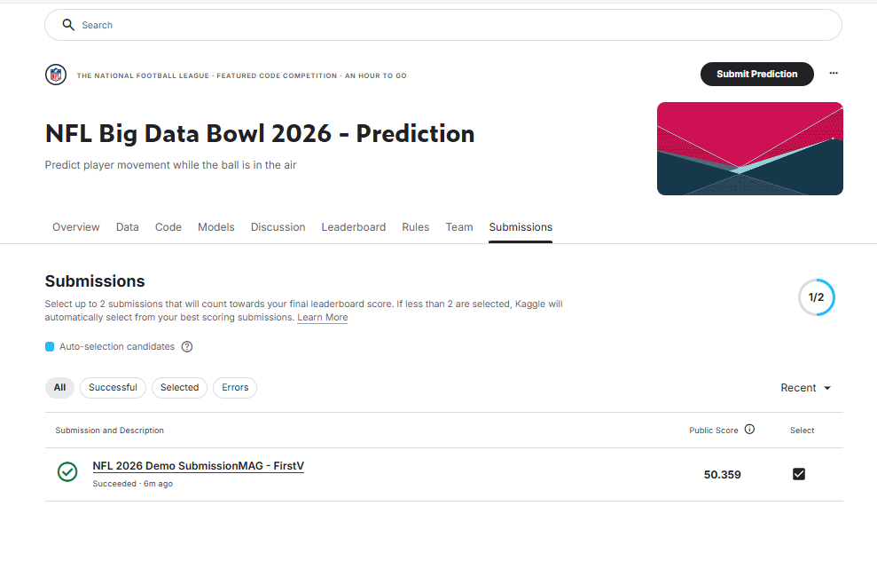
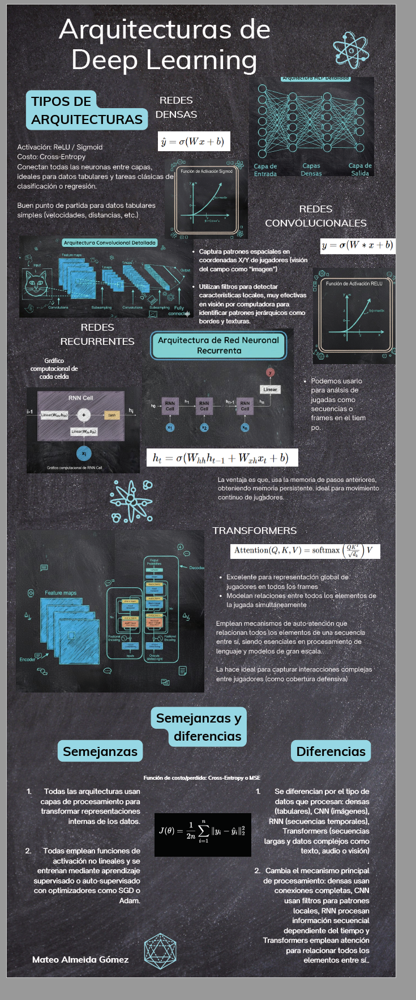

# Parcial 2 — Teoría de Aprendizaje de Máquina (TAM 2025-2)

### Universidad Nacional de Colombia

**Curso:** Teoría de Aprendizaje de Máquina  
**Profesor:** Andrés Marino Álvarez Meza  
**Estudiante:** Mateo Almeida Gómez  
**Periodo:** 2025-2  
**Repositorio:** `MLT-LR/PYDevEnv/devContent/tests/P2/...`

---

## Descripción General

Este proyecto implementa un **pipeline de aprendizaje profundo (DL)** para predecir coordenadas finales \((x, y)\) en el reto **NFL Big Data Bowl 2026** (Kaggle). Se evalúan cuatro arquitecturas ligeras: **MLP denso, CNN1D, LSTM y Transformer ligero**, siguiendo el flujo de preprocesamiento tabular, entrenamiento con Keras/TensorFlow y comparación de métricas (MAE, RMSE, MAPE, R²).

- **Notebook** → [NB implementation](NFLModelFinalVersion.ipynb)

### participación (basis notebook)

---

## Entorno y dependencias

**Requisitos base**

- Python ≥ 3.9
- pip install -r requirements.txt

**Principales librerías**

- pandas / numpy / matplotlib / seaborn
- scikit-learn (preprocesamiento)
- TensorFlow / Keras
- (Opcional) Optuna para HPO ligera

---

## Roadmap del trabajo

### Etapas principales

- [x] **1 Revisión teórica (punto 1 Parcial)**

  - Comparativa conceptual de arquitecturas DL: MLP, CNN, RNN/LSTM, Transformer.
  - Identificación de entradas, salidas, funciones de costo y escenarios de uso.

- [x] **2 Exploración y preparación de datos**

  - Carga del dataset NFL Big Data Bowl 2026.
  - Limpieza, imputación y codificación categórica (one-hot), escalado numérico.
  - División 60/20/20 (train/val/test); guardado de matrices densas en `.npz`.

- [x] **3 Entrenamiento DL**

  - **MLP denso**, **CNN1D**, **LSTM**, **Transformer ligero** (self-attention pequeña).
  - Configuración común: Adam (1e-3), loss MSE, métrica MAE, EarlyStopping, batch 256.
  - Entrenos rápidos (`quick_frac`) y entrenos finales (full data, más épocas).

- [x] **4 Comparativa y resultados**

  - Tabla consolidada `dl_results_df` (MAE, RMSE, R², MAPE en val/test).
  - Selección del mejor modelo y guardado de pesos (`results/models/*.h5` o `.keras`).
  - Gráficos de dispersión y distribuciones de error para diagnóstico.

- [x] **5 Conclusiones**

  - MLP como baseline tabular eficiente; Transformer ligero para capturar interacciones cruzadas.
  - CNN1D/LSTM como referencias si hay orden/secuencia en features.
  - Próximos pasos: más épocas, más ancho/profundidad en MLP, más cabezas/embedding en Transformer, tuning ligero.

- [x] **6 Posibles mejoras**
  - Mejorar MLP & LSTM arquitecturas : - **HPO for ARCHS** → [HPO](NFLModelV2.ipynb)
  - implementar TABNET -> en kaggleNbs dir : - **kaggle nbs** → [kaggleNBS](kaggleNbs/)

---

## Estructura de Directorios (P2)

- **infografía ** → [INFOGRAFÍA](docs/Inf.pdf)

- **documentación de referencia** → [P2Doc](docs/Parcial_2_TAM_2025.pdf)

P2/  
├── data/ # Datasets y npz preprocesados  
├── ExtractedDataset/ # Insumos Kaggle (train/test)  
├── notebooks/ (opcional)  
├── results/ # Pesos, métricas, figuras  
│ ├── models/  
│ └── dl_quick_comparison.npy  
├── docs/ # Parcial_2_TAM_2025.pdf  
├── dl_models_after_premodelado.py # Script DL modular  
├── dl_models_README.md # Guía rápida de uso  
└── NFLModelFinalVersion.ipynb # Notebook principal DL

---

## Referencias

- Bishop, C. (2006). _Pattern Recognition and Machine Learning._ Springer.
- Goodfellow, I., Bengio, Y., & Courville, A. (2016). _Deep Learning._ MIT Press.
- TensorFlow / Keras Docs — https://www.tensorflow.org/
- Kaggle NFL Big Data Bowl 2026 — https://www.kaggle.com/competitions/nfl-big-data-bowl-2026
